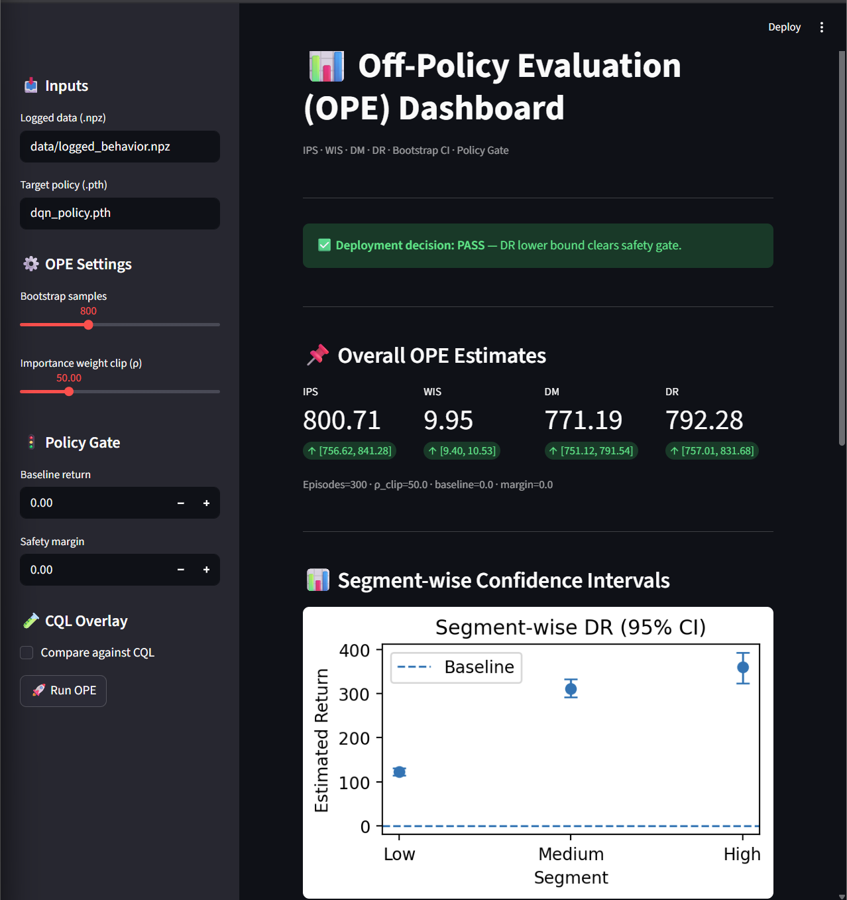
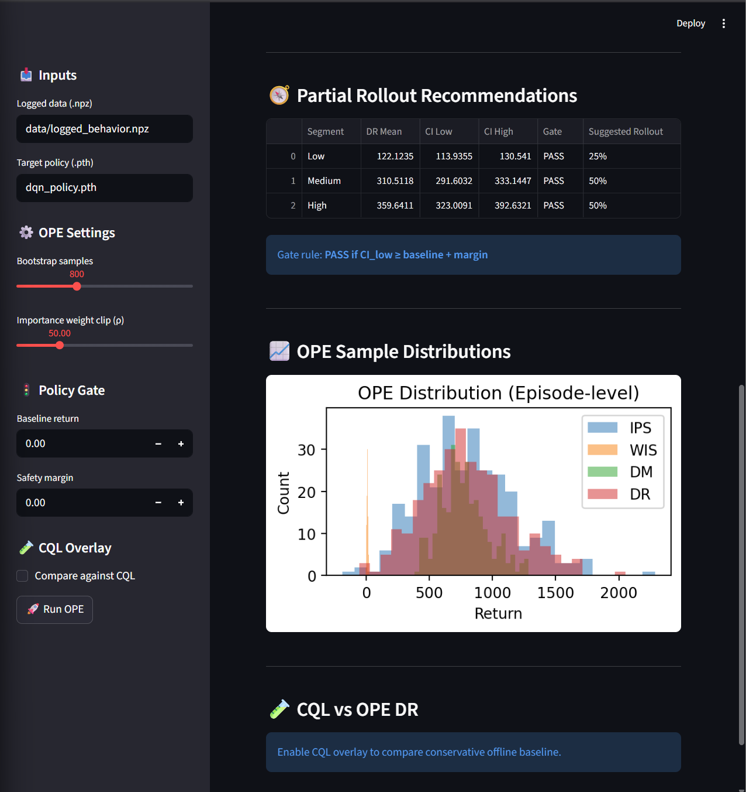
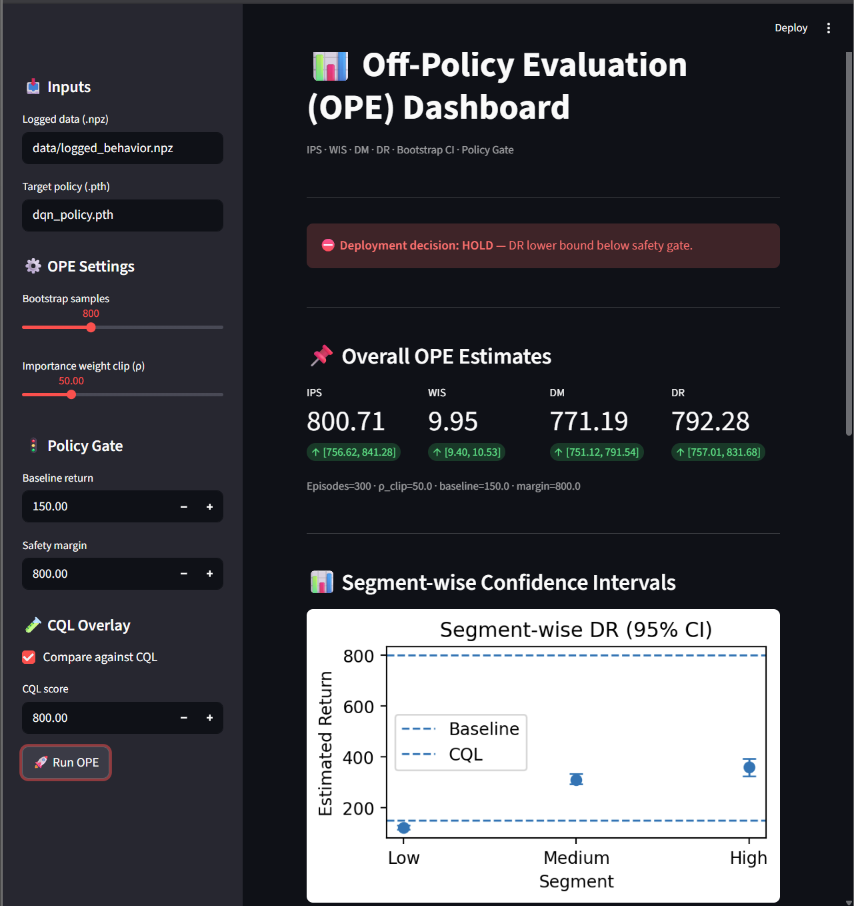
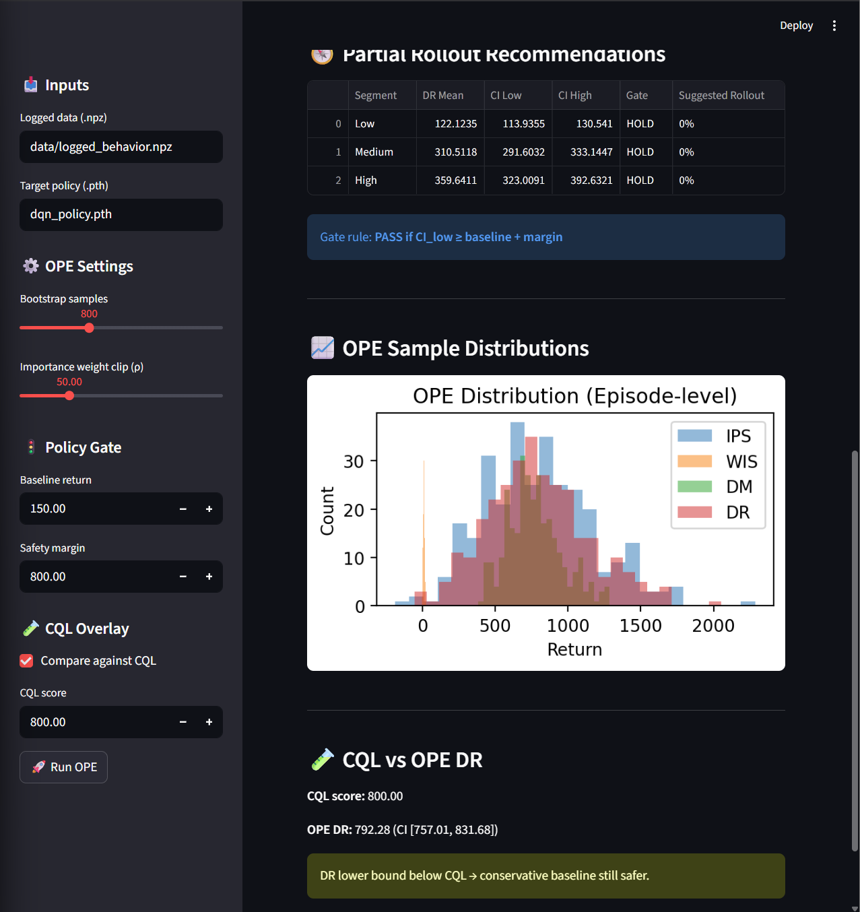
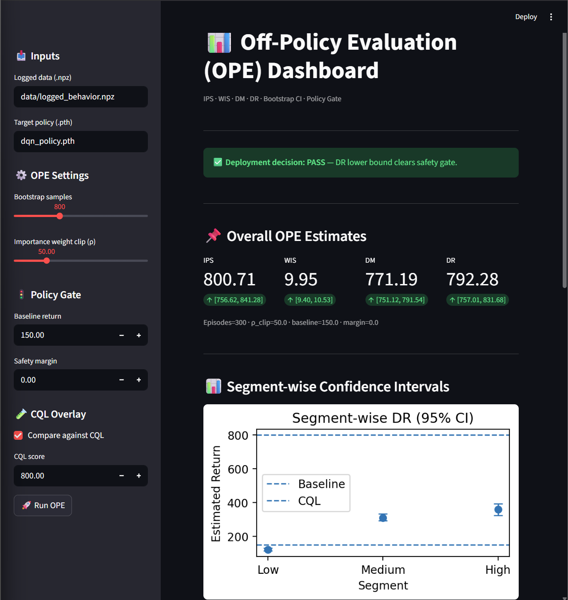
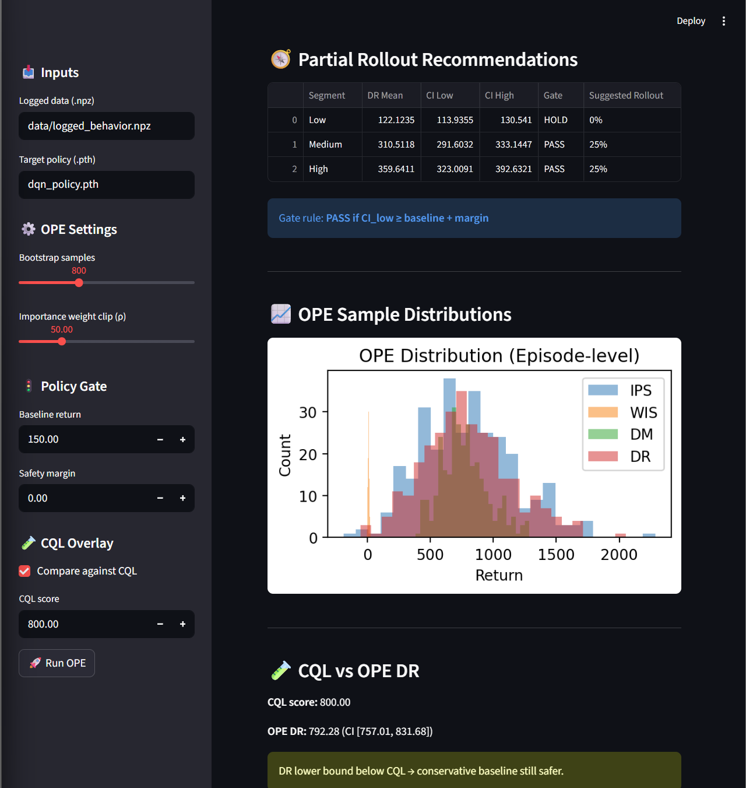

# Off-Policy Evaluation (OPE) Dashboard


A production-oriented **Off-Policy Evaluation (OPE) dashboard** for safely validating reinforcement learning policies before deployment.  
The system combines multiple OPE estimators with bootstrap confidence intervals, conservative policy gating, segment-wise analysis, and optional Conservative Q-Learning (CQL) comparison.

---

## Key Capabilities

- Importance Sampling (IPS)
- Weighted Importance Sampling (WIS)
- Direct Method (DM)
- Doubly Robust (DR)
- Bootstrap confidence intervals
- Conservative policy gate (baseline + safety margin)
- Segment-wise rollout decisions
- Optional CQL baseline comparison
- Interactive Streamlit dashboard

---

## Dashboard Demo Scenarios

The screenshots below illustrate how the dashboard supports **realistic deployment decisions**
under different safety constraints.

---

## Scenario 1: Deployment PASS (Happy Path)

**Description**  
The target policy safely outperforms the baseline. The DR lower confidence bound clears the safety gate,
enabling deployment.

**Inputs**
- Baseline return: `0`
- Safety margin: `0`
- CQL comparison: Disabled

**Outcome**
- Deployment decision: **PASS**
- All segments eligible for rollout

### Screenshots

<table>
  <tr>
    <td align="center">
      
      <br><b>Overall OPE & Deployment PASS</b>
    </td>
    <td align="center">
      
      <br><b>Segment-wise Confidence Intervals</b>
    </td>
  </tr>
</table>

---

## Scenario 2: Conservative Safety Gate (Deployment HOLD)

**Description**  
A strict baseline and safety margin prevent deployment even though point estimates are strong.
This demonstrates conservative offline safety checks.

**Inputs**
- Baseline return: `150`
- Safety margin: `800`
- CQL comparison: Enabled
- CQL score: `800`

**Outcome**
- Deployment decision: **HOLD**
- Conservative baseline remains safer than policy

### Screenshots

<table>
  <tr>
    <td align="center">
      
      <br><b>Deployment HOLD — Safety Gate Triggered</b>
    </td>
    <td align="center">
      
      <br><b>CQL vs OPE DR Comparison</b>
    </td>
  </tr>
</table>

---

## Scenario 3: Segment-wise Decision Making (Partial Rollout)

**Description**  
Different customer segments receive different rollout recommendations based on
segment-level DR confidence intervals.

**Inputs**
- Baseline return: `150`
- Safety margin: `0`
- CQL comparison: Enabled
- CQL score: `800`

**Outcome**
- Low segment: HOLD (0%)
- Medium segment: PASS (25%)
- High segment: PASS (25%)

This demonstrates **incremental, risk-aware deployment**.

### Screenshots

<table>
  <tr>
    <td align="center">
      
      <br><b>Segment-level Confidence & Gate Decisions</b>
    </td>
    <td align="center">
      
      <br><b>Partial Rollout Recommendations</b>
    </td>
  </tr>
</table>

---


## Why This Dashboard Matters

Offline reinforcement learning is inherently risky. This project demonstrates how to:

- Avoid unsafe online experimentation
- Use statistically grounded confidence intervals
- Enforce conservative deployment gates
- Compare learned policies against strong offline baselines
- Enable partial rollouts instead of binary decisions

This mirrors evaluation workflows used in real-world reinforcement learning systems such as recommendation engines, incentives, pricing, and control.

---

## Project Structure

```text
customer-incentive-dqn/
├── analysis_ope.py              # OPE estimators + bootstrap + policy gate
├── dashboard_ope.py             # Streamlit dashboard
├── data/
│   └── logged_behavior.npz      # Logged offline trajectories
├── images/
│   ├── ope_pass_overview.png
│   ├── ope_pass_segments.png
│   ├── ope_hold_overview.png
│   ├── ope_hold_cql.png
│   ├── ope_segment_decisions.png
│   └── ope_partial_rollout.png
└── README.md

```
## Quick Start

```bash
# Clone repository
git clone https://github.com/UmarJaveedAltaf/Customer-Incentive-OPE.git
cd Customer-Incentive-OPE

# Create virtual environment
python -m venv venv
source venv/bin/activate  # Windows: venv\Scripts\activate

# Install dependencies
pip install -r requirements.txt

# Launch dashboard
streamlit run dashboard_ope.py
```
## Assumptions & Limitations

- Logged data is assumed to be generated by a stationary behavior policy
- Extreme importance weights are clipped to reduce variance
- Confidence intervals rely on bootstrap resampling
- OPE estimates may be biased under severe covariate shift

These constraints reflect standard tradeoffs in offline RL evaluation.


